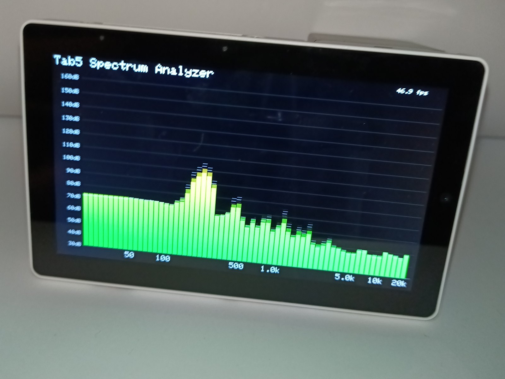

# Tab5 Spectrum Analyzer

Audio spectrum analyzer for the [M5Stack Tab5](https://docs.m5stack.com/en/core/Tab5) (ESP32-P4).
Reads the onboard mic, runs a windowed FFT, draws 64 logarithmically spaced bars on the
1280x720 display. Runs around 47 fps.



That is what it looks like with all the ducks in a row.

Same general shape as the stock M5Stack FFT bar-graph demos — mic, FFT, bars — but a Tab5
screen is a lot more pixels than a Core, and the naive draw loop does not keep up. See
[Notes](#notes).

## Display controllers

Tab5 units have shipped with more than one display controller. Mine is an **ST7121**; older
units use **ST7123**, and there may be others. M5GFX detects which is present during
`M5.begin()`, so this matters only in that an out-of-date M5GFX may not know about yours. If
the screen stays dark, update M5GFX first.

## Requirements

Developed against:

| Library | Version used |
| --- | --- |
| [M5Unified](https://github.com/m5stack/M5Unified) | 0.2.19 |
| [M5GFX](https://github.com/m5stack/M5GFX) | 0.2.26 |
| [arduinoFFT](https://github.com/kosme/arduinoFFT) | 2.0.4 |

Older versions may work. Newer is safer for display detection.

## Building

There is no Tab5 board entry in the Espressif core; the generic ESP32-P4 entry works, since
M5Unified and M5GFX sort out the Tab5 specifics at runtime. PSRAM must be enabled or the
display will not come up.

```bash
arduino-cli compile \
  --fqbn "esp32:esp32:esp32p4:FlashSize=16M,PSRAM=enabled,PartitionScheme=app3M_fat9M_16MB,CDCOnBoot=cdc" .

arduino-cli upload \
  --fqbn "esp32:esp32:esp32p4:FlashSize=16M,PSRAM=enabled,PartitionScheme=app3M_fat9M_16MB,CDCOnBoot=cdc" \
  --port /dev/ttyACM0 .
```

### Serial

Native USB CDC, so the port vanishes and re-enumerates on reset. `tio` reconnects on its own:

```bash
tio -b 115200 /dev/ttyACM0
```

Once a second the sketch prints framerate and a per-stage breakdown:

```
FPS: 47.2 | capture 21.3ms  fft 0.9ms  draw 0.6ms
```

## Tuning

Constants at the top of the sketch:

| Constant | Effect |
| --- | --- |
| `MIN_DB` / `MAX_DB` | Vertical range. Pinning to red means raise both; barely moving means lower both. |
| `ATTACK_TAU` | Rise speed. Short keeps transients sharp. |
| `RELEASE_TAU` | Fall speed. Raise toward 0.25 if jumpy, lower toward 0.08 if mushy. |
| `PEAK_FALL_PER_SEC` | Peak marker sink rate. |
| `FFT_SIZE` | 512 for more framerate headroom, 2048 for finer bass resolution. |
| `NUM_BARS` | Number of bands. |
| `FRAME_LIMIT_HZ` | 0 for unlimited. Only useful for cutting power draw. |

`setRotation(3)` puts the image the same way up as the printing on the back of the case. Use
`1` to flip it.

## Notes

Things worth knowing before changing the rendering:

- **Capture sets the framerate ceiling.** 1024 samples at 48 kHz takes ~21.3 ms to record, so
  ~47 fps is the limit. FFT and drawing are under 2 ms combined. Shrinking `FFT_SIZE` is the
  only thing that raises the ceiling.
- **Do not draw into a full-screen sprite.** ~1170 x 610 at 16 bpp is ~1.4 MB in PSRAM; clearing
  and pushing it every frame costs ~713,000 pixels twice over and drops the whole thing to
  about 2 fps. This draws into the framebuffer directly and repaints only the rows that changed.
- **Bar color depends on row height, not level.** That is what makes partial repaints correct:
  a given row is always the same color, so a growing bar only paints its new rows.
- **The FFT is single precision.** The P4 FPU has no double-precision hardware, so `double`
  gets emulated.
- **Low bands interpolate between bins.** Below roughly 50 Hz a display band is narrower than
  one FFT bin, and adjacent bars would otherwise read the same bin and move as one flat block.

## Calibration

The dB numbers on the axis are FFT magnitudes in dB, not sound pressure level. The scale is
arbitrary and mic-dependent, which is why `MIN_DB` and `MAX_DB` need hand-tuning per unit. Two
companion sketches measure corrections against known sources. Both print CSV plus a paste-ready
offset table; both need the `USBMode=hwcdc` build flag (see below).

`Tab5_MicCalibration/` — **piezo, ~5-10 kHz, absolute.** Drives a bare piezo element (TDK
PS1240P02BT or equivalent, *not* a buzzer with a built-in oscillator) from GPIO G1 on ExtPort1.
Compares the measured level at each frequency against the part's datasheet SPL curve to produce
an absolute offset. Scope is limited to roughly 5-10 kHz: the piezo is resonant, so below that
it is too quiet and its square-wave harmonics land on its own 4-5 kHz resonance and swamp the
fundamental. Each frequency is measured over several runs and only points that are stable
run-to-run are emitted — run-to-run spread, not point count, is what limits quality here, and it
is almost always the acoustic rig moving.

`Tab5_MicCalibration_Headphone/` — **headphone, full range, relative.** For the range the piezo
cannot reach. A dynamic headphone driver (e.g. Koss Porta Pro) is broadband and can excite low
frequencies cleanly, but gives no absolute reference, so this measures the *shape* of the mic
response, not dB SPL. You play tones from a phone or laptop tone generator; the sketch detects
each and logs its level, advancing automatically. Combine the two: use the piezo's clean ~5 kHz
point to pin the headphone sketch's relative curve to an absolute level. The sketch header walks
through the arithmetic.

Both share the caveat that the emitter's own response is part of the measurement, and both depend
entirely on a fixed, repeatable distance between source and mic — near-field level changes fast
with distance, so a rig that drifts between tones records that drift as response error.

### The hwcdc build flag

On this ESP32-P4 the default `Serial` routing (`CDCOnBoot=cdc`) drives the analyzer's display
but delivers no serial output to the host. The calibration sketches need serial, so they build
with `USBMode=hwcdc` added, which routes `Serial` through the USB-Serial/JTAG peripheral that
actually reaches the host. The trade is that the display goes blank in that mode — fine for the
calibration sketches, which only need serial, but the reason the **analyzer** stays on the
plain `cdc` flag (it needs the screen, not serial). Do not flash the analyzer with `hwcdc` or
you lose its display.

```bash
arduino-cli compile \
  --fqbn "esp32:esp32:esp32p4:FlashSize=16M,PSRAM=enabled,PartitionScheme=app3M_fat9M_16MB,CDCOnBoot=cdc,USBMode=hwcdc" .
arduino-cli upload \
  --fqbn "esp32:esp32:esp32p4:FlashSize=16M,PSRAM=enabled,PartitionScheme=app3M_fat9M_16MB,CDCOnBoot=cdc,USBMode=hwcdc" \
  --port /dev/ttyACM0 .
```

The shape of the resulting curve is considerably more trustworthy than its absolute height,
which traces back to a datasheet minimum measured in an anechoic chamber.

## License

None chosen. Absent a license the default is all rights reserved, which is probably not the
intent — pick one before this matters to anybody.
